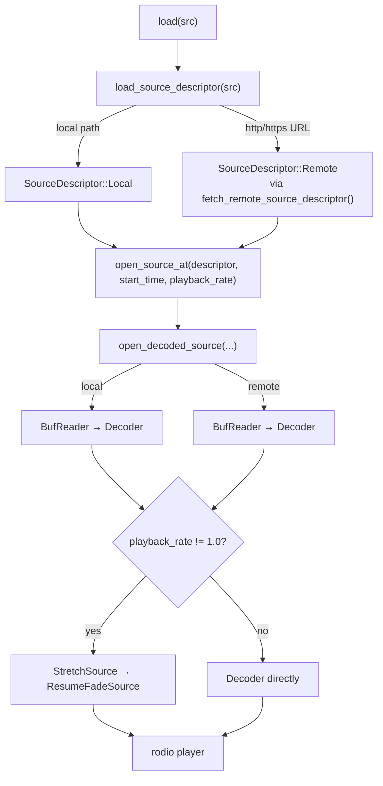
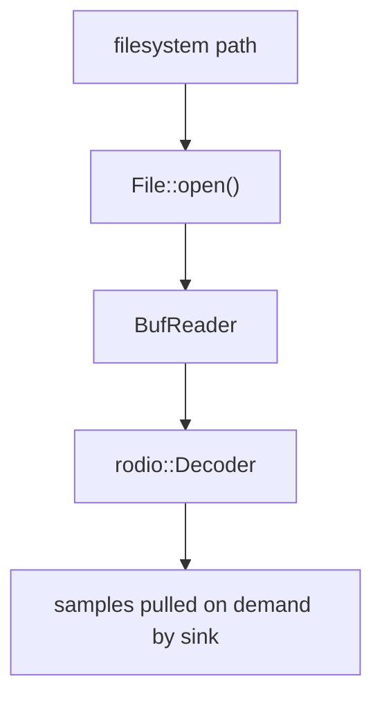
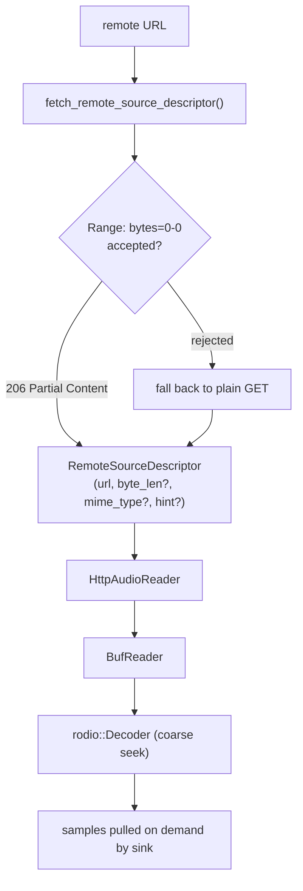
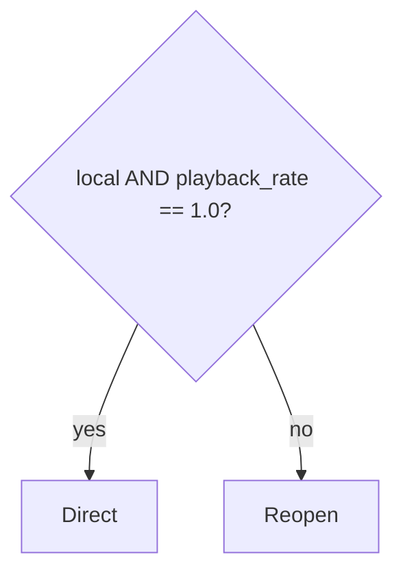
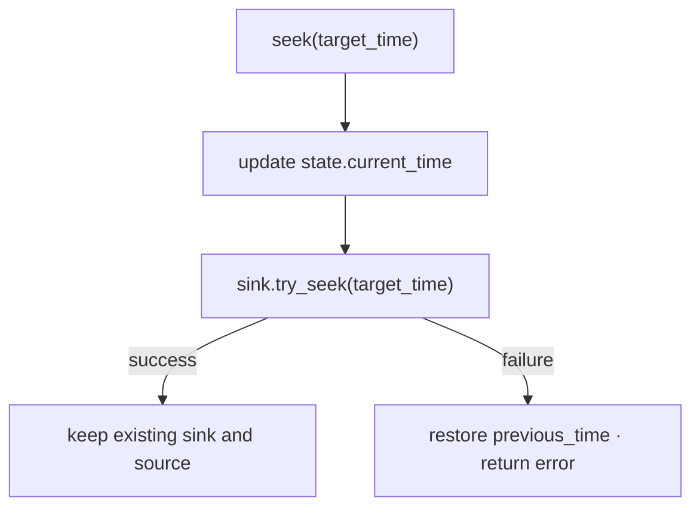
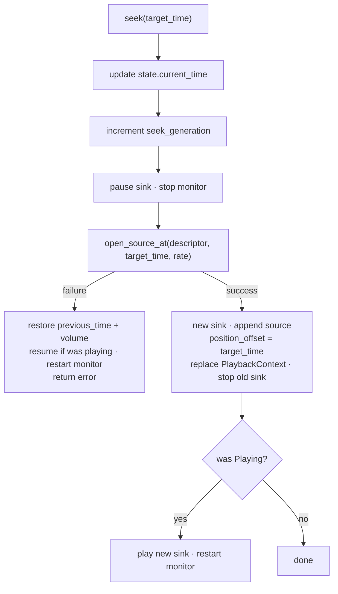
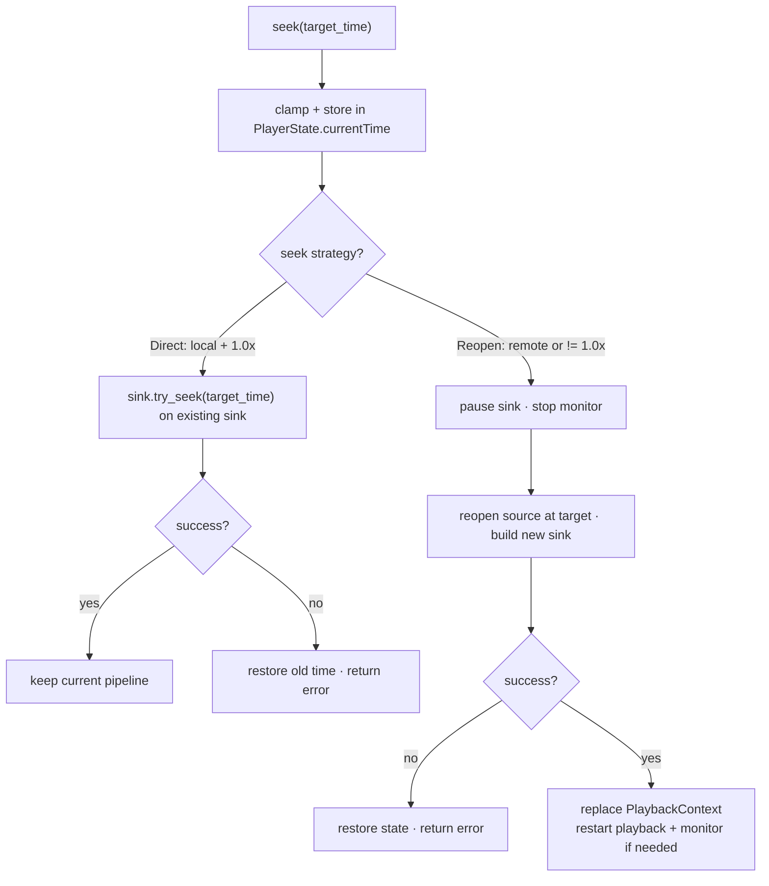
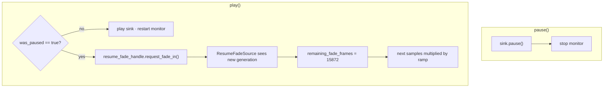

# Player internals

This directory contains the low-level playback pipeline used by `RodioAudioPlayer`.
It is responsible for:

- Opening local and remote audio sources
- Decoding them incrementally instead of loading the whole file into memory
- Choosing the seek strategy that best fits the current source and playback rate
- Applying time-stretching for non-`1.0x` playback
- Smoothing resume-from-pause for stretched playback with a short fade-in

## High-level flow



## How streaming works

Both local and remote playback are stream-oriented.
The player does not read the entire asset into memory before playback begins.
Instead, Rodio pulls samples from a decoder, and that decoder pulls bytes from a reader as needed.

## Local sources

Local sources are opened by `open_local_source()`.



Key details:

- The file is read incrementally through `BufReader<File>`.
- The decoder is created with `with_seekable(true)`.
- For local files, `with_coarse_seek(false)` is used.
- If `open_source_at()` is asked to start at a non-zero time, the decoder immediately performs `try_seek(start_time)` before playback starts.
- At normal speed (`1.0x`), local playback can usually seek in-place without rebuilding the sink.

## Remote sources

Remote sources are opened by `open_remote_source()` and use `HttpAudioReader`.



Key details:

- Only `http://` and `https://` are accepted here.
- Private hosts are rejected before a remote descriptor is created.
- The descriptor probe tries to discover `content-length`, `content-range`, `content-type`, and a format hint.
- `HttpAudioReader` implements both `Read` and `Seek`.
- Its `Seek` implementation is not a simple in-memory cursor move: it updates the target byte position, clears the active HTTP reader, and allows the next read to reopen the network stream from that point.
- The decoder is built with `with_coarse_seek(true)` for remote sources, which fits the fact that remote repositioning is byte-range based and may not be sample-perfect.

## Why there are two seek strategies

The player uses one of two strategies stored in `SeekStrategy`:

- `Direct`
- `Reopen`

The strategy is chosen in `open_source_at()`:



That means:

- **Local + `1.0x`** uses direct sink seeking
- **Remote + any rate** uses reopen
- **Local + non-`1.0x`** also uses reopen, because the active source is wrapped in stretch/fade adapters instead of being a plain decoder path

## Seeking strategy

### Direct seek path

This is the fast path for local playback at normal speed.



Behavior notes:

- The existing sink stays alive.
- The existing decoded source stays attached.
- `position_offset` is reset to `0.0`.
- If the track had already ended and the sink is empty, the player first reopens the source at `0.0`, appends it, and then performs the direct seek.

### Reopen seek path

This is used for remote playback and all non-`1.0x` playback.



### Why `position_offset` exists

When playback is reopened at a non-zero point, the new sink starts counting from zero again.
The monitor thread reports user-facing time like this:

```text
current_time = position_offset + (max(sink_elapsed - position_latency, 0.0) * playback_rate)
```

For normal `1.0x` playback, `position_latency` is `0.0`.
For stretched playback, it removes the time-stretcher's output pre-roll so `current_time` tracks audible media time instead of buffered sink time.

So after reopening at `37.5s`, the sink can still start from zero internally while the public clock continues from `37.5s`.

## Seek decision tree



## Playback-rate stretching

When `playback_rate != 1.0`, the decoded source is wrapped in `StretchSource`.
This uses `signalsmith::PlaybackStream` to convert decoded samples into time-stretched output.


Important consequence:

- The sink is no longer working with a plain local decoder path.
- Because of that, the player uses the `Reopen` seek strategy for non-`1.0x` playback, even for local files.

## Fading strategy on resume

Resume fading only exists for stretched playback.
At `1.0x`, there is no `ResumeFadeSource`, so no resume fade is requested.

The trigger happens in `play()`:

```text
if previous state was Paused
   and current PlaybackContext has a ResumeFadeHandle
then
   request_fade_in()
```

`request_fade_in()` increments a generation counter.
The audio thread notices that generation change on the next samples it produces and starts a fresh fade-in window.

### What the fade wrapper does

`ResumeFadeSource` wraps the inner source and applies a gain envelope to each sample:

- Fade length: `15872` frames
- Rough duration:
  - about `360 ms` at `44.1 kHz`
  - about `331 ms` at `48 kHz`
- Envelope shape: half-cosine ramp from `0.0` to `1.0`

The gain value is:

```text
gain(step) = 0.5 * (1 - cos(pi * progress))
```

where `progress` moves from `0.0` to `1.0` across the fade window.

### Resume fade trigger



### Fade envelope on resume

```text
gain
1.0 |                                              **************
    |                                         *****
    |                                     ****
    |                                  ***
    |                               ***
    |                            ***
    |                         ***
    |                      ***
    |                   ***
    |               ****
    |           *****
0.0 |***********
    +------------------------------------------------------------> time
     resume            half-cosine fade-in (~331-360 ms)         steady
```

### Frame-based behavior

The fade is tracked per frame, not per individual sample value.
For multi-channel audio, the gain stays constant for all samples in the same frame and only advances after the channel group is complete.

```text
stereo frame 0:  L R  -> gain g0
stereo frame 1:  L R  -> gain g1
stereo frame 2:  L R  -> gain g2
...
```

This keeps left and right channels aligned during the ramp.

### What resume fade does not do

Resume fade is intentionally narrow in scope:

- It is **not** applied on initial load
- It is **not** applied to normal `1.0x` playback
- It is **not** used as part of the seek flow itself
- A direct `try_seek()` on the fade wrapper clears any in-progress fade state

## Monitor thread interaction

The monitor thread polls every `250 ms` and publishes time updates.
After a reopen-based seek, it is restarted so that updates come from the new sink.

```text
audible_sink_time = max(sink.get_pos() - position_latency, 0.0)
monitor time = position_offset + (audible_sink_time * playback_rate)
```

This is what keeps user-visible time correct across:

- reopened seeks
- playback-rate changes
- loop restarts

## Practical summary

- **Local source, normal speed**: read from file lazily, decode lazily, seek directly on the existing sink.
- **Remote source**: stream over HTTP lazily, reopen the stream when seeking, and tolerate servers that ignore `Range` by skipping bytes manually.
- **Non-`1.0x` playback**: wrap decoded audio in a stretch pipeline, use reopen-based seeking, and apply a short fade-in when resuming from pause.
